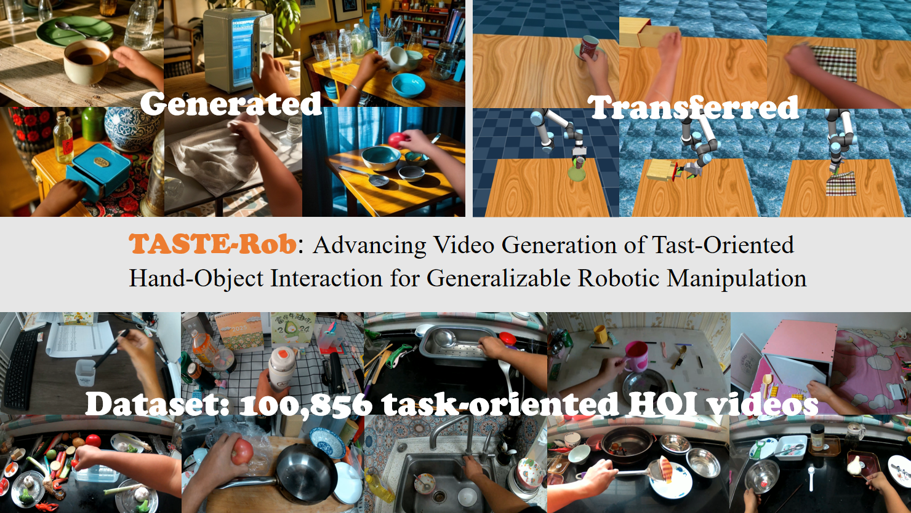

<h1 align="center"><strong>TASTE-Rob: Advancing Video Generation of Task-Oriented Hand-Object Interaction for Generalizable Robotic Manipulation
</strong></h1>
<p align="center">
      <strong><span style="color: red;">CVPR 2025</span></strong>
    <br>
    <a href='https://hong-xiang-cv.github.io/' target='_blank'>Hongxiang Zhao*</a>&emsp;
    Xingchen Liu*</a>&emsp;
    <a href='https://mutianxu.github.io/' target='_blank'>Mutian Xu</a>&emsp;
    <a href='https://scholar.google.com/citations?user=mlu1Oo4AAAAJ&hl=en' target='_blank'>Yiming Hao</a>&emsp;
    <a href='https://chenweikai.github.io/' target='_blank'>Weikai Chen</a>&emsp;
    <a href='https://gaplab.cuhk.edu.cn/' target='_blank'>Xiaoguang Han§</a>&emsp;
    <br>
    CUHKSZ <a href='https://gaplab.cuhk.edu.cn/' target='_blank'>GAP-Lab</a>   
    <br>
    *Indicates Equal Contribution §Indicates Corresponding Author
    <br>
  </p>

<p align="center">
  <a href="https://taste-rob.github.io/"><b>📖 Project Page</b></a> |
  <a href="https://arxiv.org/abs/2503.11423"><b>📄 Paper Link</b></a> |
  <a href="https://docs.google.com/forms/d/e/1FAIpQLSdOlNnW3t_7TGC2FMDMcIb7jnhRjfynq6xLoz5rJk_i-fl5zQ/viewform?usp=sf_link"><b>🎥 Dataset Form</b></a>
</p>

</div>

> We introduce TASTE-Rob: 1) a dataset with 100,856 task-oriented hand-object interaction videos, 2) a three-stage pose-refinement video generation pipeline. With the above contributions, TASTE-Rob is able to generate realistic interactions and support the possibility of transferring on robots.

<div align="center">
    
</div>

> If you find our work useful in your research, please consider citing:
```
@InProceedings{Zhao_2025_CVPR,
    author    = {Zhao, Hongxiang and Liu, Xingchen and Xu, Mutian and Hao, Yiming and Chen, Weikai and Han, Xiaoguang},
    title     = {TASTE-Rob: Advancing Video Generation of Task-Oriented Hand-Object Interaction for Generalizable Robotic Manipulation},
    booktitle = {Proceedings of the Computer Vision and Pattern Recognition Conference (CVPR)},
    month     = {June},
    year      = {2025},
    pages     = {27683-27693}
}
```

## 📣 News
- [6/7/2025] TASTE-Rob Dataset Download Tool has been released now!!!
- [5/3/2025] TASTE-Rob Dataset has been released now!!!
- [3/14/2025] TASTE-Rob has been released on Arxiv!!!
- [2/27/2025] 🎉🎉🎉TASTE-Rob has been accepted by CVPR 2025!!!🎉🎉🎉

## 🚩 Plan
- [x] Paper Released.
- [x] Dataset will be released before ``05/05/2025``.
- [ ] Source Code and Pretrained Weights.

## 🎥 Dataset
TASTE-Rob contains 100,856 task-oriented ego-centric hand-object interaction videos crossing different environments. We provide an OneDrive link to download the full data. Please fill out this [form](https://docs.google.com/forms/d/e/1FAIpQLSdOlNnW3t_7TGC2FMDMcIb7jnhRjfynq6xLoz5rJk_i-fl5zQ/viewform?usp=sf_link), and we will send the download link and password to your e-mail soon.

We split the full data into SingleHand/DoubleHand and multiple environments, the total size is about 1.55 TB.

### Folder structure
```
|-- TASTE_Rob
    |-- SingleHand  # stores videos with single-hand interaction captions
        |-- Bathroom
            |-- 50254.mp4
            |-- 50255.mp4
            |-- 50256.mp4
            |-- ...
        |-- Bedroom
        |-- Dinning
        |-- DressingTable
        |-- Kitchen
        |-- Office
    |-- DoubleHand  # stores videos with single-hand interaction captions
        |-- Bathroom
        |-- Dinning
        |-- Kitchen
        |-- Office
    |-- captions.xlsx  # stores captions
```

In ```captions.xlsx```, the sheet ```Single-Hand``` stores single-hand interaction captions, and the sheet ```Double-Hand``` stores double-hand interaction captions. In each sheet, there has three attributes: ```id```, ```scene``` and ```caption```. You could search ids of desired videos in this excel file.

## 🎥 Dataset Download Tool
You could use ```download_tool_taste_rob.py``` to download zip files or mp4 files, as follows:
```
python download_tool_taste_rob.py \
    --file_list downlist.txt \
    --url {our_given_url} \
    --download_folder {local_path_of_downloaded_files} \
    --force True
```
To download successfully, you need to modify ```our_given_url```, ```local_path_of_downloaded_files``` and ```downlist.txt```, which stores desired file paths.

## License

The data is released under the TASTE-Rob Terms of Use.

Copyright (c) 2025
